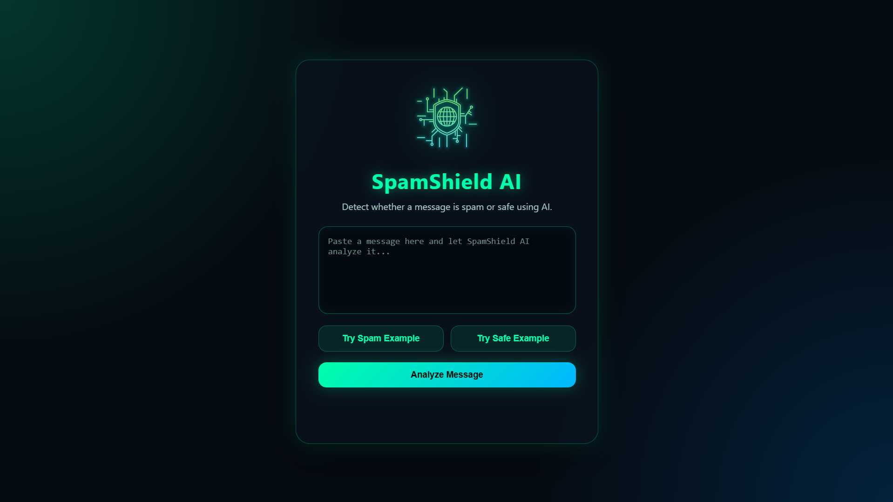
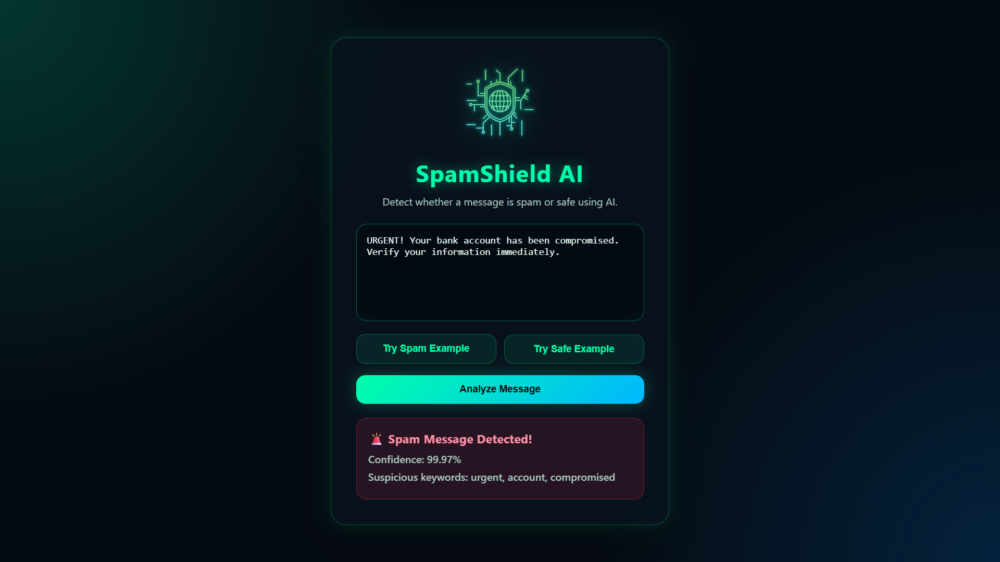
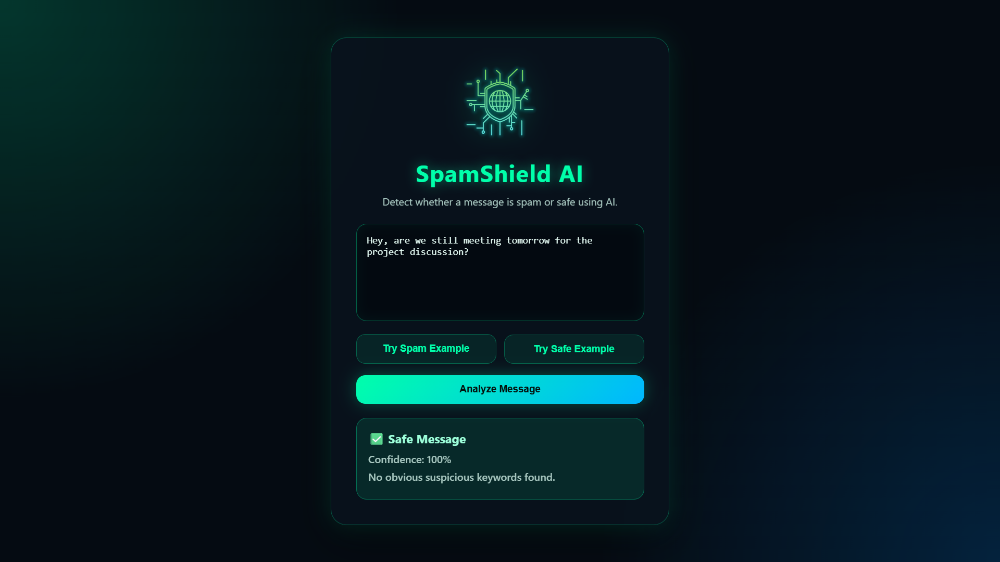

# 🛡️ SpamShield AI

SpamShield AI is a cybersecurity-inspired AI web application that detects whether a message is spam or safe using Machine Learning and Natural Language Processing (NLP).

---

## ✨ Features

- 🚨 Spam message detection
- ✅ Safe message detection
- 📊 Confidence percentage
- 🔍 Suspicious keyword analysis
- 🎨 Cybersecurity-inspired UI
- 🤖 Machine Learning model using Scikit-learn
- 🌐 Flask web application

---

## 🧠 Technologies Used

- Python
- Flask
- Scikit-learn
- HTML
- CSS
- JavaScript

---

## 📚 AI Concepts Used

- Machine Learning
- Natural Language Processing (NLP)
- Naive Bayes Classification
- Text Vectorization

---

## 🚀 How to Run

```bash
pip install flask scikit-learn pandas
python train_model.py
python app.py```

```bash
pip install flask scikit-learn pandas
python train_model.py
python app.py
```

Then open:

```text
http://127.0.0.1:5000
```

## 📸 Screenshots

### 🏠 Homepage



---

### 🚨 Spam Detection Example



---

### ✅ Safe Message Detection Example


